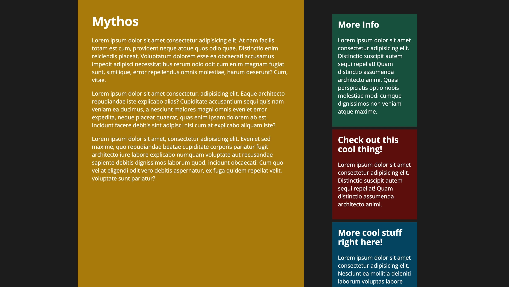

# Grid - SASS project

This is a project of the [Coder Coder](https://www.youtube.com/watch?v=jfMHA8SqUL4) Sass, BEM, & Responsive Design course. The website feautures the basics of Sass, BEM (block-element-modifier), and the principles of responsive design.

## About The Project

The project aims to create a grid component using Sass with a main widget and three sidebar widgets. The widgets were filled with lorem ipsum placeholders. The project was structured following a similar architecture of the [7-1 pattern](https://sass-guidelin.es/#architecture). 

[Shorter namespaces](https://sass-lang.com/documentation/at-rules/use#choosing-a-namespace) were used to refer modules (to avoid variable namimg conflicts) . It was done by writing `@use "<url>" as <namespace>`.

The [Live Sass Compiler](https://marketplace.visualstudio.com/items?itemName=ritwickdey.live-sass) VS Code extesion was used to complie Scss files to CSS at realtime with live browser reload.

[Helper/Utility classes](https://davidtheclark.com/on-utility-classes/) were used to set background colors to widgets instead of BEM modifiers in order to reuse them in other components.

Live site: [https://alffonti.github.io/grid/dist/index.html)

## Built with

- [SASS](https://sass-lang.com/)
- [BEM](https://getbem.com/)
- Responsive Design

## Acknowledgments

- [Coder Coder](https://coder-coder.com/)
- [Wes Bos](https://wesbos.com/courses)
- [Kevin Powell](https://www.youtube.com/kevinpowell)
- [Andy Bell](https://css-tricks.com/author/andybell/)